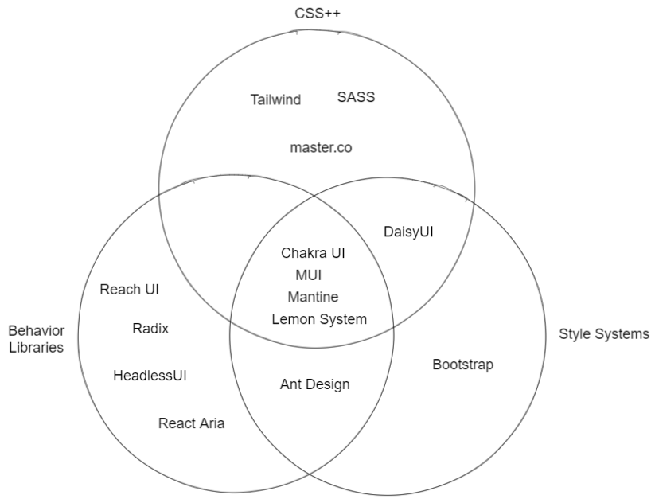
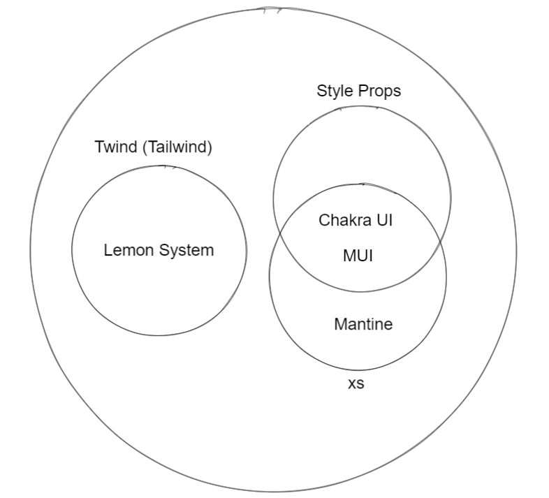
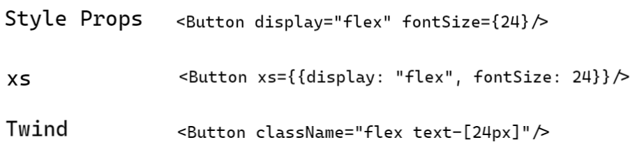
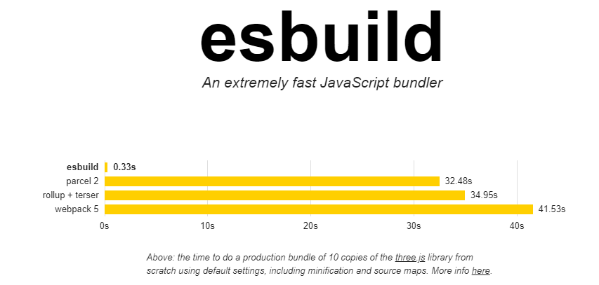
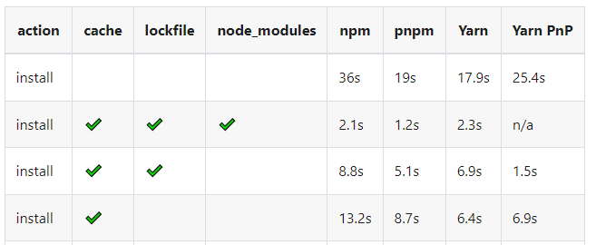

Para el desarrollo de Lemon System, la librería UI del design system de Lemontech, hemos tomado diferentes decisiones en lo que respecta a implementaciones técnicas. En este blog planteamos las dificultades técnicas a las que nos vimos enfrentados y el cómo y por qué optamos por solucionarlas.

<!--truncate-->

> 🚧 La librería sigue en desarrollo, debido a esto puede que algunos topicos escritos aquí con el tiempo cambien o esten desactualizados.

# Requerimientos

Los siguientes requerimientos fueron planteados para Lemon System:

- Debe ser consistente con el Design System de Lemontech.
- Debe ser facilmente adaptable en los equipos de Lemontech, considerando la conformación de estos en su mayoría por ingenieros Full-Stacks.
- No debe crear mayores inconvenientes al ser implemenado en nuevas o ya creadas aplicaciones.

# Decisiones de implementación 

## Enfoque

*Clasificación de Librerías más populares de UI.*

Existen variados enfoques para definir una librería de interfaces, las cuales las podemos dividir en tres grandes grupos: Las librerías que entregan un CSS potenciado con nuevas funcionalidades (CSS++), librerías que solamente brindan estilos a los componentes (Style Systems) y librerías que ofrecen un manejo del comportamiento de los componentes (Behavior Libraries).

La necesidad principales que se quería cubrir era la de acelerar los desarrollos internos y crear una forma de que estos sean consistentes con el Design System de Lemontech en las diferentes aplicaciones que se desarrollasen, por esto, la mejor opción era optar por una librería que cubriese las 3 categorías mencionadas, tal como lo hace [MUI](https://mui.com), la librería UI de React de Google, que brinda tanto nuevas opciones de implementación de CSS, estilos por defecto y un ya implementado comportamiento para los componentes de la librería. 

*Sub-categorias de librerías.*

Una de los puntos a considerar para que la librería fuese facilmente adoptada era que su estilización no fuese dificil y preferiblemente que no se tuviese que crear CSS StyleSheets sino que fuese simplemente con clases de Tailwind CSS, que era algo que en ciertos equipos ya estaban acostumbrados y les facilitiba el desarrollo.

En las librerías investigadas: Chakra UI, MUI y Mantine. La estilización es mediante estilos como propiedad (Style Props) usando/inspirandose en librerías como [Styled System](https://styled-system.com) y [Theme UI](https://theme-ui.com)

*Sub-categorias de librerías.*

Este enfoque de crear una librería la cual, aparte de brindar estilos y comportamiento, se pudiese estilizar con Tailwind CSS es novedoso y no teniamos presedentes en los cuales inspirarnos, por lo cual hicimos una investigación al respecto para probar su factibilidad técnica.

- Tailwind CSS
- Twin.macro
- Twind

Lo primero que se puede pensar es: ¿por qué no usar simplemente Tailwind CSS?. Es una pregunta totalmente valida pero que lastitamente resulta dificil el implementarlo. 

[Tailwind CSS](https://tailwindcss.com) en una aplicación de React funciona con el post-procesador de CSS llamado [Autoprefixer](https://autoprefixer.github.io). Juntos pueden inyectar css a un fichero CSS StyleSheet con las clases de Tailwind CSS que son usadas en la app.

La principal complicación técnica que tiene el implementar Tailwind CSS en la librería directamente es que es imperioso para Tailwind inyectar CSS en un CSS StyleSheet ya que este trabaja con un postCSS. Por lo que este proceso ya no se le puede encargar a la librería sino que la responsabilidad de configurar Tailwind CSS es traspasada al que implementa la librería en su aplicación, y lo mismo con respecto a su configuración que dependería del framework que este ocupando (create-react-app, Next.js, Vite, etc...). 

Además de...

## Definición de Bundle

Para empaquetar el codigo fuente y poder distribuir la librería en npm teniamos diferentes opciones:

- Webpack
- Rollup
- Esbuild

Uno de los principios que tomamos al optar por soluciones son la simplicidad y la eficienca. 

Webpack es la solución más comun actualmente para las aplicaciones web, lo usa **create-react-app** y **next.js** (por el momento) sin embargo la libertad que da para ser configurado complejiza su implementación en una librería donde debe ser configurado de cero, por otro lado, no es el empaquetador más rapido por lo que la agilidad del deploy del proyecto se vería afectado. 

Rollup y Esbuild son dos soluciones más contemporaneas que webpack, en ambas su implementación es más sencilla y directa, sin embargo, por lejos, era mucho mayor la eficiencia en el tiempo de empaquetado que nos daba Esbuild, que por detras usa el lenguaje Go y compila a lenguaje maquina.

 
*Benchmark https://esbuild.github.io*

## Administrador de paquetes

Como administrador de librerías se tomaron en cuenta las siguientes:

- npm
- yarn
- pnpm

Uno de los principios técnicos por lo que nos guiamos para la contrucción de Lemon System fue la simplicidad, el evitar implementaciónes que no contuviesen mayores beneficios.

Con respecto a Yarn, si bien, tiempo atras, era optada por usarse en vez de npm debido a que era más eficiente como administrador de paquetes, actualmente no hay gran diferencía entre estas, y sumandole el hecho de que yarn sea algo externo a Node y no viniese con este instalado como si lo hace npm es por lo cual que lo descartamos.

Pnpm nos ofrecia una mayor eficiencia que npm, pero decidimos optar por esta ultima sin embargo, esto debido a que con pnpm nos encontramos con problemas de compatibilidad con otras librerías debido a su forma de organizar *node_modules*.

 
 *Benchmark https://pnpm.io/benchmarks*

## Repositorio

- Monorepo (turborepo)
- Monolito
